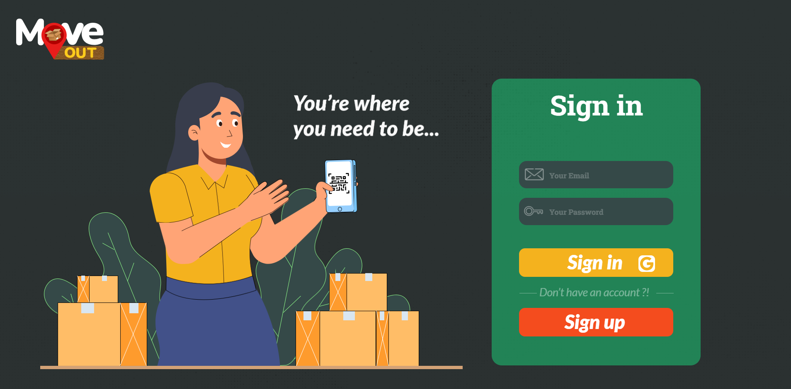
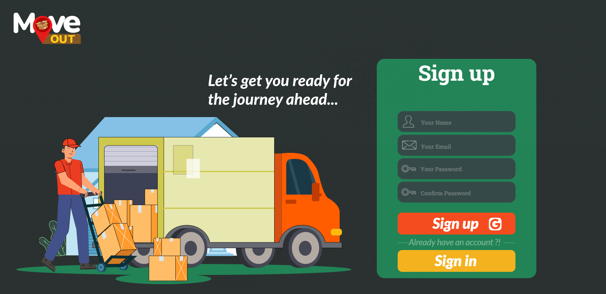
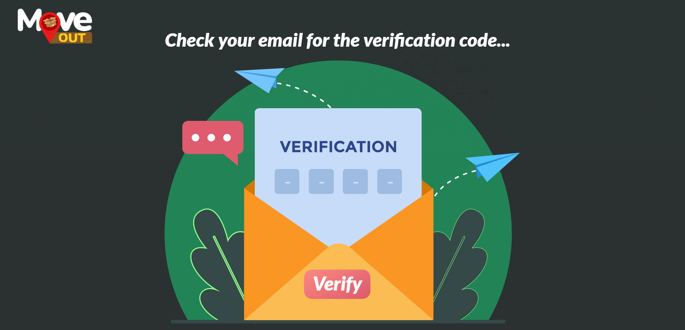
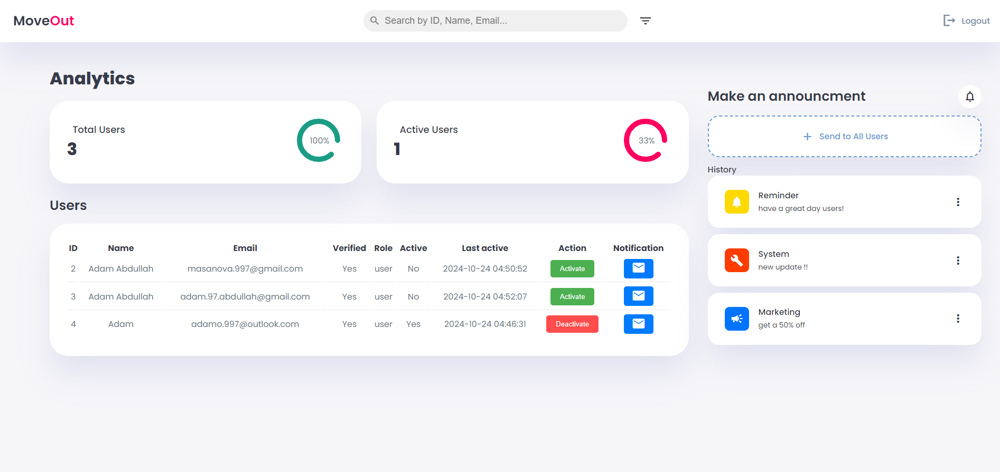
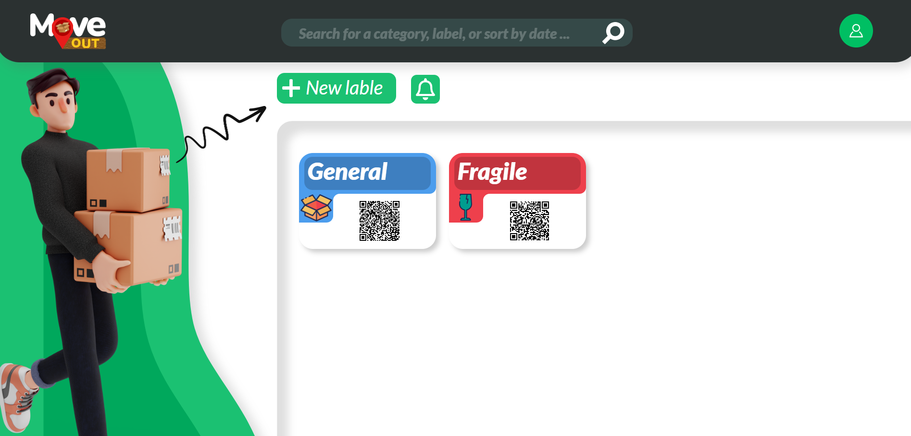
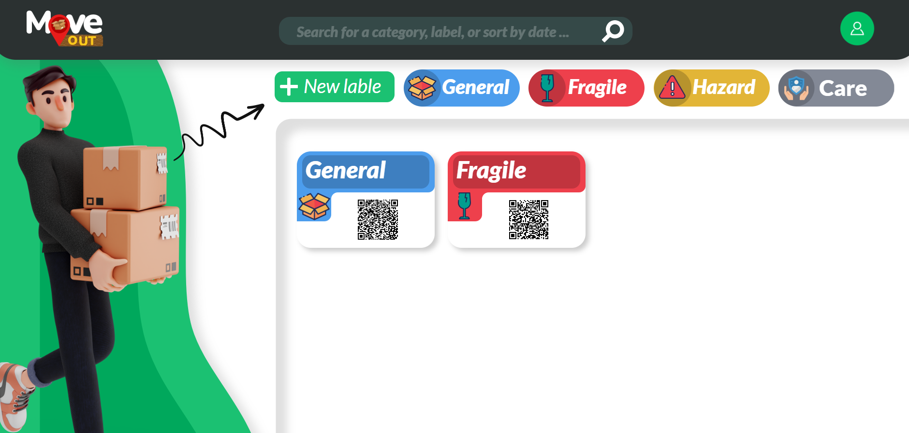
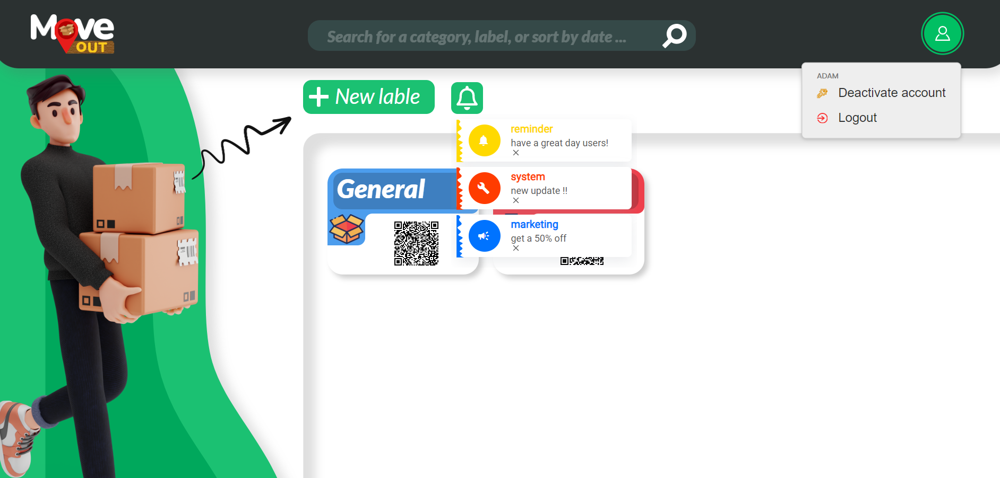

# Title
MoveOUT: Label and Inventory Management Application

## Introduction
MoveOUT is an intuitive label and inventory management application built to help individuals and organizations organize, track, and share their belongings with ease. Whether you’re moving, managing assets, or simply staying organized, MoveOUT offers a robust system for labeling, categorizing, and securely storing item details, making inventory management effortless.

Users can create labels for their items, categorize them (e.g., fragile, hazardous, general), and attach detailed notes, voice memos, or images. Each label is assigned a unique QR code, allowing for quick and easy access to the associated information. The application also supports label sharing between users, while maintaining full control over label privacy through public and private settings.

MoveOUT features seamless integration with Google, allowing users to sign up and log in using their Google accounts for convenience. Additionally, all passwords are securely hashed to ensure user data is protected. The application utilizes Cloudinary to efficiently handle the storage of images and voice memos, providing a scalable solution for file management.

An admin dashboard is also available, offering administrators advanced control over the platform. Admins can manage user accounts, monitor data usage, and send notifications, ensuring the application runs smoothly and securely for all users.









## Architecture Overview
The following image provides an overview of the architecture of the MoveOUT system.


## How to Use

### Prerequisites

Note that this project runs on WSL (Windows Subsystem for Linux) with Ubuntu, so make sure you have it installed if you're on a Windows machine.
**WSL (Windows Subsystem for Linux)**
If you're on Windows, ensure that WSL is installed, and you're running the Ubuntu distribution. You can install WSL with the following command in PowerShell (with Administrator privileges):

    ```powershell
    wsl --install
    ```
After installing WSL, make sure you're using the Ubuntu distribution, which you can install from the Microsoft Store.
To verify WSL is working, open an Ubuntu terminal and run:

    ```bash
    wsl -l -v
    ```

To run and build the **MoveOUT** project, follow these steps carefully to ensure the environment is properly configured. The project is set up to use multiple environment files located in the `/config/` folder, including database credentials, email, Google authentication, and Cloudinary.

---

#### 1. **Node.js and npm**
- **Node.js**: Ensure you have **Node.js** (version 14.x or higher) installed. You can download it from [here](https://nodejs.org/).
- **npm**: Node Package Manager is required to install project dependencies.
  - Verify installation with:
    ```bash
    node -v
    npm -v
    ```

#### 2. **MariaDB (Database)**
- **MariaDB**: The project uses **MariaDB** for database management. Download and install MariaDB from [here](https://mariadb.org/download/).
- **Database Setup**: The database schema and procedures are managed through a provided SQL script.
  1. Open MariaDB:
     ```bash
     mariadb -u <your_username> -p <your_password>
     ```
  2. Run the **reset.sql** script located at `Sql/reset.sql` to initialize the database, create tables, and set up stored procedures:
     ```sql
     source Sql/reset.sql;
     ```
  - Ensure the user and password in the script match your setup.

#### 3. **Cloudinary**
- **Cloudinary**: Used for storing label files (images, text memos, and voice memos) as well as the generated QR codes.
  - Sign up at [Cloudinary](https://cloudinary.com/) and retrieve your **Cloud Name**, **API Key**, and **API Secret**.
  - Add these credentials to the **`/config/cloud.env`** file:
    ```plaintext
    CLOUDINARY_CLOUD_NAME=your_cloudinary_cloud_name
    CLOUDINARY_API_KEY=your_cloudinary_api_key
    CLOUDINARY_API_SECRET=your_cloudinary_api_secret
    CLOUDINARY_URL=your_cloudinary_URL
    ```

#### 4. **Google Developer Console (For Google Login)**
- **Google OAuth**: The project supports logging in using Google. To set this up:
  1. Go to [Google Developer Console](https://console.developers.google.com/).
  2. Create an OAuth2 Client and retrieve your **Client ID** and **Client Secret**.
  3. Add these credentials to the **`/config/Google.env`** file:
    ```plaintext
    GOOGLE_CLIENT_ID=your_google_client_id
    GOOGLE_CLIENT_SECRET=your_google_client_secret
    GOOGLE_REDIRECT_URI=http://localhost:3000/auth/google/callback
    ```

#### 5. **Email (Nodemailer for Email Verification)**
- **Nodemailer**: This project uses **Nodemailer** to send email verifications. You'll need a Gmail account with **App Passwords** set up to allow secure access for Nodemailer.
  1. Create an **App Password** under your Gmail account settings.
  2. Add the credentials to the **`/config/email.env`** file:
    ```plaintext
    EMAIL_USER=your_gmail_address@gmail.com
    EMAIL_PASS=your_app_password
    ```

#### 6. **Database Configuration (config.json)**
- **config.json**: The **MariaDB** credentials and database connection details should be set in `/config/config.json`. Ensure the file contains:
    ```json
    {
      "database": {
        "host": "localhost",
        "user": "<your_username>",
        "password": "<your_password>",
        "database": "moveout_app",
        "port": 3306
      }
    }
    ```

#### 7. **Installing Project Dependencies**
- Since the `node_modules` folder is in `.gitignore`, you need to manually install all project dependencies.
  - Run the following command to install all required npm packages:
    ```bash
    npm install
    ```

---

By setting up these configurations in their respective files inside the `/config/` folder, your environment will be ready to build, run, and deploy the **MoveOUT** project. Proceed to the build and run steps once all prerequisites are met.

### Build

To build and run the **MoveOUT** project, follow the steps below. These instructions are specifically for users working in **WSL (Windows Subsystem for Linux) with Ubuntu**, or any Linux-based environment.

---

#### 1. **Clone the Repository**
- Start by cloning the project from the repository into your local development environment:
  ```bash
  git clone https://github.com/Adamo-97/Move-out-app
  cd moveout-app
  ```

#### 2. **Install Dependencies**
- Since `node_modules` is excluded via `.gitignore`, you need to install all dependencies manually.
- Run the following command to install all the necessary npm packages:
  ```bash
  npm install
  ```
  This command will install all the dependencies listed in the `package.json` file, including essential packages like `express`, `mysql2`, `cloudinary`, `nodemailer`, and others.

#### 3. **Set Up Environment Variables**
- Ensure that all environment variables are correctly set in the respective files in the `/config/` folder:
  - `/config/cloud.env`: For Cloudinary configuration.
  - `/config/email.env`: For email settings (Gmail and Nodemailer).
  - `/config/Google.env`: For Google OAuth credentials.
  - `/config/config.json`: For MariaDB database connection.

- Double-check that all these files contain the correct values. If any changes are needed, you can manually update the variables in these files.

#### 4. **Run the Database Setup (Reset SQL Script)**
- To initialize the **MariaDB** database, you will use the provided **reset.sql** script located at `/Sql/reset.sql`.
- To execute the script:
  1. Log in to MariaDB from your Ubuntu terminal:
     ```bash
     mysql -u <your_username> -p
     ```
  2. Run the reset script to drop any existing tables and re-create them along with stored procedures:
     ```sql
     source Sql/reset.sql;
     ```

  This will prepare your database with all necessary tables, stored procedures, and data structure required for the application.

#### 5. **Run the Application**
- To start the application, you need to stand in the main root of the project (`moveout-app`) and use the following command:
  ```bash
  node main.js
  ```
- This will start the application, and it will be accessible at `http://localhost:3000` by default.

---

#### 6. **Optional: Run in Development Mode**
- For development purposes, if you prefer hot-reloading (where the server automatically restarts after file changes), use **nodemon**:
  ```bash
  npm install -g nodemon
  nodemon main.js
  ```

---

By following these steps, you will have the **MoveOUT** project built correctly and running in your development environment. You can now proceed with testing and working on the application.

### Test

The **MoveOUT** project does not include automated unit or integration tests at this time. Instead, debugging and testing are performed manually through the console during development. Here’s how you can monitor and manually test the application:

---

#### 1. **Manual Testing Workflow**
- **Debugging Through Console**:
  - During development, most issues are identified by observing the server and client logs.
  - To view logs and errors, start the application by running:
    ```bash
    node main.js
    ```
  - Monitor the console for any errors or warnings related to server, database, or API calls.

- **Testing Endpoints**:
  - Use tools like **Postman** or **cURL** to manually test the API endpoints, such as user login, label creation, and sharing features.
  - For example, to test the label creation API using **Postman**:
    1. Select **POST** request.
    2. Set the request URL to `http://localhost:3000/your-endpoint`.
    3. Provide the necessary body data (e.g., label name, memo, etc.).
    4. Check the response in the **Postman** console to verify if it’s working as expected.

#### 2. **Testing Database Operations**
- **MariaDB Queries**:
  - You can manually verify database changes by running SQL queries in MariaDB.
  - For example, after creating a new label, you can run the following query in MariaDB to confirm that the label has been added:
    ```sql
    SELECT * FROM labels WHERE user_id = 1;
    ```

#### 3. **Error Handling and Debugging**
- Watch for **stack traces** in your terminal when running the app. These errors typically provide insights into what might be causing issues in the backend, such as:
  - Database connection errors.
  - API endpoint failures.
  - Cloudinary upload errors.
  
- Use `console.log()` statements liberally in your JavaScript files to trace values and understand what might be causing any issues if needed otherwise you can monitor the logs i already have.

#### 4. **Manual Browser Testing**
- Perform manual browser testing to ensure the frontend works as expected.
  - Navigate through the app to check functionalities such as login, label creation, sharing, and notification panels.
  - Open the **developer tools** in your browser (usually by pressing F12) to check for any frontend errors or warnings.

---

Here’s the updated **Run** section with the correct details about account deactivation and the admin's role:

---

### Run

To run the **MoveOUT** project, follow these steps to start both the server (backend) and the client (frontend). The project runs entirely on **Node.js**, with the client interacting with the server through web pages.

---

#### 1. **Start the Server**

The **MoveOUT** project’s backend server is powered by **Node.js** and **Express**. Here’s how to start it:

1. **Ensure Prerequisites**: 
   - Make sure you have completed all the setup steps, including installing dependencies, setting up environment variables, and configuring the database.

2. **Navigate to the Project Root**: 
   - Open your terminal and navigate to the root directory of the project (where the `main.js` file is located).
   ```bash
   cd /moveout-app
   ```

3. **Run the Server**: 
   - Use the following command to start the server:
   ```bash
   node main.js
   ```
   - This will launch the Node.js server, and the application will be accessible at `http://localhost:3000`.

4. **Server Logs**:
   - As the server runs, any actions performed by the client (such as creating or sharing labels) will be logged in the terminal. You can monitor this for debugging or for tracking activities on the backend.

---

#### 2. **Access the Application (Client)**

Once the server is running, the frontend of the **MoveOUT** project can be accessed through a web browser.

1. **Open a Web Browser**:
   - Open your preferred browser (e.g., Chrome, Firefox).

2. **Navigate to the Application**:
   - Type the following address in your browser’s URL bar to access the app:
   ```
   http://localhost:3000
   ```
   - This will load the home page of the **MoveOUT** application.

---

#### 3. **Working with the Client (User/Admin Actions)**

1. **Login/Signup**:
   - Users can log in using their email or the **"Continue with Google"** option.
   - **Admin Login**: Admins can log in using the following credentials:
     - **Admin Email**: `admin@moveout.com`
     - **Password**: `123`

2. **User Actions**:
   - After logging in, users can:
     - **Create, Edit, Delete, and Share Labels**: Users can manage their labels, but **NOTE** that the **Edit** and **Share** features currently work only for **General** labels.
       - **Editing Labels**: The **edit label** feature only works for **General labels** at the moment. Users can edit text memos, but voice memos and images still require additional logic to be fully functional.
       - **Other Label Categories**: For labels in categories such as **Fragile**, **Hazard**, and **Care**, the edit functionality is not implemented yet.
     - **Care Label**: The **Care** label category is currently just a placeholder and is not connected to the backend. Interacting with this category’s fields will not trigger any actions.
     - **Sharing Labels**: The **Share** functionality works for **General labels**, allowing users to share their labels with others. Sharing for other categories has not been implemented yet.
     - **Print Labels**: Users can print their labels once created.
     - **Notifications**: Users have access to a notification panel where they can see updates about shared labels and other activities.
     - **Search**: Search bar is for show aswell still havent implemented any logic to connect it to my backend.
     - **User Profile**: When clicking on the user icon it will give you 2 options, the deactivation currently doesnt do anything but the logout destoys the session and logs the user out.
3. **Admin Actions**:
   - **Account Deactivation**: Only **admins** have the ability to deactivate user accounts. While there are stored procedures in place to handle deactivation and updating the last active status, these are **not yet integrated into the code**. 
     - For now, admins can manually set a user’s status to **inactive** through the database.
     - After deactivation, if you wish to remove a user entirely, you will need to manually delete the user from the database or perform the appropriate cleanup actions.
   - Admins can also:
     - **Search for users**.
     - **Send marketing emails** to specific or all users.
     - **Activate/Deactivate accounts**.

---

#### 4. **Stopping the Server**

When you’re done using the application and want to stop the server, simply press `CTRL + C` in your terminal where the server is running. This will terminate the Node.js process.

## License

This project is licensed under the MIT License - see the [LICENSE](LICENSE) file for details.
